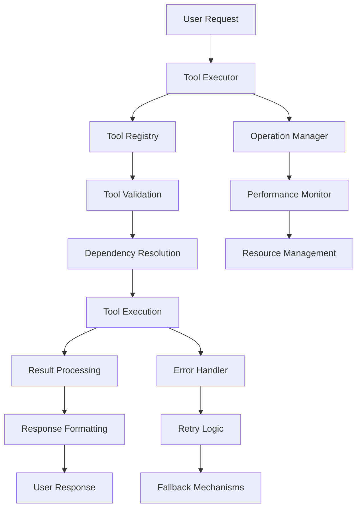

# AI Code Editor Tool System Architecture

## Overview

The AI Code Editor's tool system is a modular, high-performance architecture designed for scalable code analysis, file operations, research, and engineering tasks. This document provides a comprehensive overview of the system's architecture, design patterns, and implementation details.

## Table of Contents

1. [System Architecture](#system-architecture)
2. [Core Components](#core-components)
3. [Module Organization](#module-organization)
4. [Data Flow](#data-flow)
5. [Design Patterns](#design-patterns)
6. [Performance Architecture](#performance-architecture)
7. [Security Architecture](#security-architecture)
8. [Extension Points](#extension-points)
9. [Deployment Architecture](#deployment-architecture)

## System Architecture

### High-Level Architecture

```
┌─────────────────────────────────────────────────────────────┐
│                    AI Code Editor Frontend                   │
├─────────────────────────────────────────────────────────────┤
│                     Tool Executor                           │
│  ┌─────────────────┐  ┌─────────────────┐  ┌──────────────┐ │
│  │  Tool Registry  │  │ Operation Mgr   │  │ Performance  │ │
│  └─────────────────┘  └─────────────────┘  └──────────────┘ │
├─────────────────────────────────────────────────────────────┤
│                    Tool Categories                          │
│  ┌──────────────┐ ┌──────────────┐ ┌──────────────────────┐ │
│  │ File Ops     │ │ Code Analysis│ │ Research Tools       │ │
│  └──────────────┘ └──────────────┘ └──────────────────────┘ │
│  ┌──────────────┐ ┌──────────────┐ ┌──────────────────────┐ │
│  │ Engineering  │ │ System Mgmt  │ │ Shared Utilities     │ │
│  └──────────────┘ └──────────────┘ └──────────────────────┘ │
├─────────────────────────────────────────────────────────────┤
│                    Core Infrastructure                      │
│  ┌─────────────────┐  ┌─────────────────┐  ┌──────────────┐ │
│  │ Tool Interfaces │  │ Dependency Graph│  │ Error Handler│ │
│  └─────────────────┘  └─────────────────┘  └──────────────┘ │
└─────────────────────────────────────────────────────────────┘
```

### Component Interaction Flow



## Core Components

### 1. Tool Executor (`tool_executor.js`)

The central orchestrator that manages all tool operations.

**Key Responsibilities:**
- Tool execution coordination
- Performance monitoring and optimization
- Error handling and recovery
- Resource management
- Concurrent operation management

**Architecture Pattern:** Singleton with Strategy Pattern for tool selection

```javascript
class ToolExecutor {
  constructor() {
    this.registry = new ToolRegistry();
    this.operationManager = new OperationManager();
    this.performanceMonitor = new PerformanceMonitor();
    this.dependencyGraph = new DependencyGraph();
  }
  
  async executeTool(toolName, parameters, options = {}) {
    // Execution logic with full error handling and performance monitoring
  }
}
```

### 2. Tool Registry (`tool_registry.js`)

Central registry for all available tools with metadata and validation.

**Key Responsibilities:**
- Tool registration and discovery
- Metadata management
- Validation rule enforcement
- Category organization
- Dependency tracking

**Architecture Pattern:** Registry Pattern with Factory Method

```javascript
class ToolRegistry {
  constructor() {
    this.tools = new Map();
    this.categories = new Map();
    this.validators = new Map();
  }
  
  registerTool(name, toolFunction, metadata) {
    // Registration with validation and categorization
  }
}
```

### 3. Tool Interfaces (`tool_interfaces.js`)

Standardized interfaces and response formats for all tools.

**Key Responsibilities:**
- Response format standardization
- Input validation
- Security wrapper functions
- Error response formatting

**Architecture Pattern:** Interface Segregation with Decorator Pattern

## Module Organization

### File Structure

```
frontend/js/tools/
├── core/                          # Core system components
│   ├── tool_executor.js          # Main orchestrator (673 lines)
│   ├── tool_registry.js          # Central registry (427 lines)
│   └── tool_interfaces.js        # Standard interfaces (298 lines)
├── file_operations/               # File manipulation tools
│   ├── file_readers.js           # Reading operations
│   ├── file_writers.js           # Writing operations
│   └── file_managers.js          # Management operations
├── code_analysis/                 # Code analysis and parsing
│   ├── analyzers.js              # AST and structure analysis
│   ├── search_tools.js           # Code search and pattern matching
│   └── quality_tools.js          # Quality metrics and linting
├── research/                      # Web research and documentation
│   ├── web_research.js           # Multi-stage research
│   └── search_engines.js         # Search engine integrations
├── engineering/                   # Advanced engineering tools
│   ├── senior_ai_tools.js        # AI-assisted development
│   └── debugging_tools.js        # Systematic debugging
├── system/                        # System management
│   ├── operation_manager.js      # Operation lifecycle
│   ├── performance_tools.js      # Performance monitoring
│   └── dependency_graph.js       # Dependency management
└── utils/                         # Shared utilities
    └── shared_utils.js           # Common functions
```

### Category-Based Organization

#### 1. File Operations Category
- **Purpose**: File system interactions and content manipulation
- **Tools**: 12 tools across reading, writing, and management
- **Performance**: Optimized for large files with streaming support
- **Security**: Input sanitization and path validation

#### 2. Code Analysis Category
- **Purpose**: Code parsing, analysis, and quality assessment
- **Tools**: 8 tools for AST analysis, search, and quality metrics
- **Performance**: Caching and incremental analysis
- **Features**: Multi-language support, symbol table generation

#### 3. Research Category
- **Purpose**: Web research and documentation retrieval
- **Tools**: 6 tools for multi-stage research and search
- **Performance**: Parallel processing and intelligent caching
- **Features**: Content relevance scoring, knowledge gap detection

#### 4. Engineering Category
- **Purpose**: Advanced development and debugging assistance
- **Tools**: 5 tools for systematic problem-solving
- **Performance**: AI-assisted analysis with fallback mechanisms
- **Features**: Symbol table building, debugging workflows

#### 5. System Management Category
- **Purpose**: System monitoring and operation management
- **Tools**: 7 tools for performance and dependency management
- **Performance**: Real-time monitoring with adaptive thresholds
- **Features**: Resource management, operation cancellation

## Data Flow

### Request Processing Pipeline

```
1. Request Validation
   ├── Parameter validation
   ├── Security checks
   └── Tool availability verification

2. Dependency Resolution
   ├── Dependency graph analysis
   ├── Execution order determination
   └── Resource requirement calculation

3. Execution Planning
   ├── Performance optimization
   ├── Concurrency planning
   └── Timeout configuration

4. Tool Execution
   ├── Pre-execution hooks
   ├── Core tool logic
   └── Post-execution cleanup

5. Result Processing
   ├── Response formatting
   ├── Error handling
   └── Performance metrics collection

6. Response Delivery
   ├── Success/failure indication
   ├── Data payload
   └── Metadata inclusion
```

### Data Structures

#### Standard Tool Response
```javascript
{
  success: boolean,
  data: any,
  error?: string,
  metadata: {
    executionTime: number,
    toolName: string,
    timestamp: string,
    operationId: string
  },
  performance?: {
    memoryUsage: number,
    processingMethod: string,
    optimizations: string[]
  }
}
```

#### Tool Registration Metadata
```javascript
{
  name: string,
  category: string,
  description: string,
  parameters: ParameterSchema,
  timeout: number,
  retryable: boolean,
  dependencies: string[],
  performance: {
    estimatedDuration: number,
    memoryRequirement: string,
    canRunInParallel: boolean
  }
}
```

## Design Patterns

### 1. Strategy Pattern
Used in tool selection and execution strategies.

```javascript
class ExecutionStrategy {
  execute(tool, parameters) {
    // Strategy-specific execution logic
  }
}

class StreamingStrategy extends ExecutionStrategy {
  execute(tool, parameters) {
    // Streaming execution for large operations
  }
}
```

### 2. Observer Pattern
Used for performance monitoring and event handling.

```javascript
class PerformanceMonitor {
  constructor() {
    this.observers = [];
  }
  
  notify(event) {
    this.observers.forEach(observer => observer.update(event));
  }
}
```

### 3. Command Pattern
Used for operation management and undo functionality.

```javascript
class ToolCommand {
  constructor(tool, parameters) {
    this.tool = tool;
    this.parameters = parameters;
  }
  
  execute() {
    return this.tool.execute(this.parameters);
  }
  
  undo() {
    // Undo logic if supported
  }
}
```

### 4. Factory Pattern
Used for tool instantiation and configuration.

```javascript
class ToolFactory {
  static createTool(type, config) {
    switch (type) {
      case 'file_reader':
        return new FileReader(config);
      case 'code_analyzer':
        return new CodeAnalyzer(config);
      // ... other tool types
    }
  }
}
```

### 5. Decorator Pattern
Used for adding cross-cutting concerns like logging, caching, and security.

```javascript
class SecurityDecorator {
  constructor(tool) {
    this.tool = tool;
  }
  
  async execute(parameters) {
    // Security checks
    const sanitizedParams = this.sanitizeInput(parameters);
    const result = await this.tool.execute(sanitizedParams);
    return this.sanitizeOutput(result);
  }
}
```

## Performance Architecture

### 1. Adaptive Performance System

```javascript
class AdaptivePerformanceSystem {
  constructor() {
    this.thresholds = {
      memoryUsage: 0.8,
      executionTime: 30000,
      errorRate: 0.1
    };
    this.adaptations = new Map();
  }
  
  adapt(metrics) {
    if (metrics.memoryUsage > this.thresholds.memoryUsage) {
      this.enableStreamingMode();
    }
    
    if (metrics.executionTime > this.thresholds.executionTime) {
      this.increaseTimeout();
    }
  }
}
```

### 2. Caching Strategy

- **L1 Cache**: In-memory results for frequently accessed data
- **L2 Cache**: Persistent cache for expensive operations
- **Cache Invalidation**: Time-based and dependency-based invalidation

### 3. Resource Management

```javascript
class ResourceManager {
  constructor() {
    this.memoryPool = new MemoryPool();
    this.connectionPool = new ConnectionPool();
    this.operationQueue = new PriorityQueue();
  }
  
  allocateResources(operation) {
    // Resource allocation with priority and limits
  }
}
```

## Security Architecture

### 1. Input Validation

```javascript
class InputValidator {
  static validateFileOperation(params) {
    // Path traversal prevention
    // File size limits
    // Content type validation
  }
  
  static validateCodeAnalysis(params) {
    // Code injection prevention
    // Resource limit enforcement
  }
}
```

### 2. Output Sanitization

```javascript
class OutputSanitizer {
  static sanitizeFileContent(content) {
    // Remove sensitive information
    // Escape dangerous characters
    return sanitizedContent;
  }
}
```

### 3. Rate Limiting

```javascript
class RateLimiter {
  constructor() {
    this.limits = new Map();
    this.windows = new Map();
  }
  
  checkLimit(toolName, userId) {
    // Token bucket or sliding window implementation
  }
}
```

## Extension Points

### 1. Custom Tool Registration

```javascript
// Register a custom tool
toolRegistry.registerTool('custom_analyzer', customAnalyzerFunction, {
  category: 'code_analysis',
  description: 'Custom code analysis tool',
  parameters: {
    file_path: { type: 'string', required: true },
    analysis_type: { type: 'string', default: 'basic' }
  },
  timeout: 15000,
  retryable: true
});
```

### 2. Custom Performance Monitors

```javascript
class CustomPerformanceMonitor extends PerformanceMonitor {
  collectMetrics(operation) {
    const metrics = super.collectMetrics(operation);
    // Add custom metrics
    metrics.customMetric = this.calculateCustomMetric(operation);
    return metrics;
  }
}
```

### 3. Custom Error Handlers

```javascript
class CustomErrorHandler extends ErrorHandler {
  handleError(error, context) {
    // Custom error handling logic
    if (error.type === 'CUSTOM_ERROR') {
      return this.handleCustomError(error, context);
    }
    return super.handleError(error, context);
  }
}
```

## Deployment Architecture

### 1. Development Environment

```
┌─────────────────────────────────────┐
│         Development Setup           │
├─────────────────────────────────────┤
│ • Local file system access         │
│ • Debug logging enabled            │
│ • Hot reload support               │
│ • Extended timeouts                │
│ • Detailed error messages          │
└─────────────────────────────────────┘
```

### 2. Production Environment

```
┌─────────────────────────────────────┐
│        Production Setup             │
├─────────────────────────────────────┤
│ • Sandboxed file operations        │
│ • Optimized performance settings   │
│ • Compressed responses             │
│ • Rate limiting enabled            │
│ • Security hardening              │
└─────────────────────────────────────┘
```

### 3. Configuration Management

```javascript
class ConfigurationManager {
  constructor(environment) {
    this.config = this.loadConfig(environment);
    this.applyEnvironmentOverrides();
  }
  
  loadConfig(env) {
    const configs = {
      development: {
        timeout: 60000,
        retryAttempts: 5,
        enableDebugLogging: true,
        maxConcurrency: 10
      },
      production: {
        timeout: 30000,
        retryAttempts: 3,
        enableDebugLogging: false,
        maxConcurrency: 5
      }
    };
    return configs[env] || configs.production;
  }
}
```

## Quality Assurance

### 1. Testing Strategy

- **Unit Tests**: Individual tool function testing
- **Integration Tests**: Tool chain and dependency testing
- **Performance Tests**: Load and stress testing
- **Security Tests**: Vulnerability and penetration testing

### 2. Monitoring and Observability

```javascript
class SystemMonitor {
  constructor() {
    this.metrics = new MetricsCollector();
    this.alerts = new AlertManager();
    this.dashboard = new DashboardManager();
  }
  
  collectSystemMetrics() {
    return {
      toolExecutions: this.metrics.getToolExecutionCount(),
      averageResponseTime: this.metrics.getAverageResponseTime(),
      errorRate: this.metrics.getErrorRate(),
      memoryUsage: this.metrics.getMemoryUsage(),
      activeOperations: this.metrics.getActiveOperationCount()
    };
  }
}
```

### 3. Health Checks

```javascript
class HealthChecker {
  async performHealthCheck() {
    const checks = [
      this.checkToolRegistry(),
      this.checkFileSystemAccess(),
      this.checkMemoryUsage(),
      this.checkDependencyGraph()
    ];
    
    const results = await Promise.allSettled(checks);
    return this.aggregateHealthStatus(results);
  }
}
```

## Future Architecture Considerations

### 1. Microservices Migration
- Tool categories as separate services
- API gateway for tool routing
- Service mesh for communication

### 2. Cloud-Native Features
- Serverless function deployment
- Auto-scaling based on demand
- Distributed caching

### 3. AI/ML Integration
- Intelligent tool selection
- Predictive performance optimization
- Automated error resolution

This architecture provides a solid foundation for scalable, maintainable, and high-performance tool operations while maintaining flexibility for future enhancements and extensions.