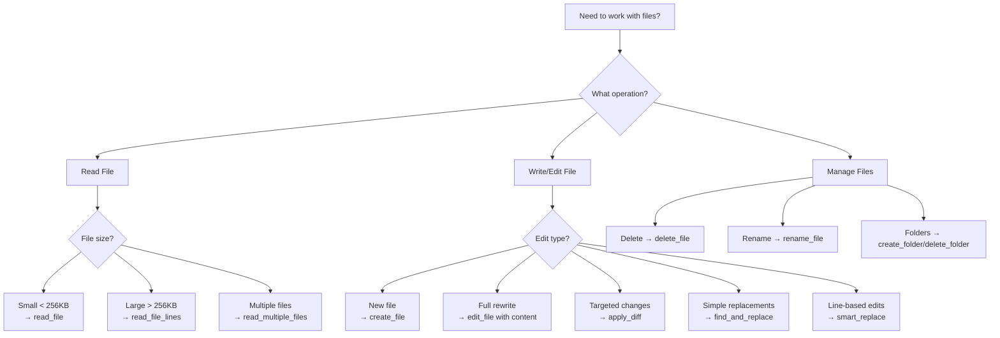

# Tool Selection Guidelines

## Overview

The AI Code Editor provides a comprehensive set of tools organized into specialized modules. This guide helps developers choose the right tool for their specific needs, understand when to use different approaches, and optimize their workflow for maximum efficiency.

## Quick Reference: When to Use Which Tool

### File Operations Decision Tree



## File Operations Tools

### Reading Files

#### [`read_file`](../frontend/js/tools/file_operations/file_readers.js)
**Best for:** Small to medium files (< 256KB), when you need complete content

```javascript
// ✅ Good use cases
await toolExecutor.executeTool('read_file', {
  filename: 'src/components/Button.jsx',
  include_line_numbers: true
});

// ❌ Avoid for large files (will be truncated)
await toolExecutor.executeTool('read_file', {
  filename: 'large-dataset.json' // > 1MB
});
```

**Features:**
- Automatic content truncation for large files
- Line numbering option
- Adaptive processing based on file size
- Caching for performance

#### [`read_file_lines`](../frontend/js/tools/file_operations/file_readers.js)
**Best for:** Reading specific sections of large files, targeted analysis

```javascript
// ✅ Perfect for large files
await toolExecutor.executeTool('read_file_lines', {
  filename: 'large-log-file.txt',
  start_line: 1000,
  end_line: 1050
});

// ✅ Great for debugging specific areas
await toolExecutor.executeTool('read_file_lines', {
  filename: 'src/complex-component.jsx',
  start_line: 45,
  end_line: 75
});
```

**Features:**
- Always includes line numbers
- Handles binary files gracefully
- Memory efficient for large files
- Automatic line range validation

#### [`read_multiple_files`](../frontend/js/tools/file_operations/file_readers.js)
**Best for:** Batch operations, project analysis, related file processing

```javascript
// ✅ Analyze related components
await toolExecutor.executeTool('read_multiple_files', {
  filenames: [
    'src/components/Header.jsx',
    'src/components/Footer.jsx',
    'src/components/Navigation.jsx'
  ]
});
```

**Features:**
- Parallel processing when possible
- Adaptive memory management
- Batch statistics and error handling
- Automatic editor integration

### Writing and Editing Files

#### [`create_file`](../frontend/js/tools/file_operations/file_writers.js)
**Best for:** Creating new files from scratch

```javascript
// ✅ Create new component
await toolExecutor.executeTool('create_file', {
  filename: 'src/components/NewComponent.jsx',
  content: `import React from 'react';

export default function NewComponent() {
  return <div>Hello World</div>;
}`
});
```

**Features:**
- Automatic directory creation
- Syntax validation
- Security sanitization
- Undo checkpoint creation

#### [`apply_diff`](../frontend/js/tools/file_operations/file_writers.js)
**Best for:** Precise, surgical edits with exact line matching

```javascript
// ✅ Precise code modifications
await toolExecutor.executeTool('apply_diff', {
  filename: 'src/app.js',
  diff: `<<<<<<< SEARCH
:start_line:15
-------
function oldFunction() {
  return 'old';
}
=======
function newFunction() {
  return 'new';
}
>>>>>>> REPLACE`
});
```

**When to use:**
- ✅ You know exact content to replace
- ✅ Need precise line-by-line control
- ✅ Making multiple targeted changes
- ❌ Content might have changed since analysis
- ❌ Fuzzy matching needed

#### [`find_and_replace`](../frontend/js/tools/file_operations/file_managers.js)
**Best for:** Simple text replacements, refactoring variable names

```javascript
// ✅ Rename variables across file
await toolExecutor.executeTool('find_and_replace', {
  filename: 'src/utils.js',
  find_text: 'oldVariableName',
  replace_text: 'newVariableName',
  all_occurrences: true
});
```

**When to use:**
- ✅ Simple string replacements
- ✅ Refactoring identifiers
- ✅ Updating configuration values
- ❌ Complex structural changes
- ❌ Context-sensitive replacements

#### [`smart_replace`](../frontend/js/tools/file_operations/file_managers.js)
**Best for:** Fuzzy matching when content might have minor differences

```javascript
// ✅ Replace similar content with tolerance
await toolExecutor.executeTool('smart_replace', {
  filename: 'src/component.jsx',
  old_content: `function handleClick() {
    console.log('clicked');
  }`,
  new_content: `const handleClick = useCallback(() => {
    console.log('clicked');
  }, []);`,
  similarity_threshold: 0.8
});
```

**When to use:**
- ✅ Content might have minor formatting differences
- ✅ Need fuzzy matching capabilities
- ✅ Replacing code blocks that might have changed slightly
- ❌ Need exact matching
- ❌ Multiple similar blocks exist

#### [`edit_file`](../frontend/js/tools/file_operations/file_writers.js) with edits
**Best for:** Multiple targeted changes, complex modifications

```javascript
// ✅ Multiple precise edits
await toolExecutor.executeTool('edit_file', {
  filename: 'src/component.jsx',
  edits: [
    {
      type: 'replace_lines',
      start_line: 10,
      end_line: 12,
      new_content: 'const [state, setState] = useState(initialValue);'
    },
    {
      type: 'insert_lines',
      line_number: 20,
      new_content: '  // Added new functionality'
    }
  ]
});
```

**When to use:**
- ✅ Multiple changes in one operation
- ✅ Mix of insertions and replacements
- ✅ Large files (uses streaming)
- ❌ Simple single replacements
- ❌ Need fuzzy matching

## Code Analysis Tools

### [`analyze_code`](../frontend/js/tools/code_analysis/analyzers.js)
**Best for:** Understanding code structure, AST analysis

```javascript
// ✅ Analyze JavaScript/TypeScript files
await toolExecutor.executeTool('analyze_code', {
  filename: 'src/complex-module.js'
});
```

**Features:**
- AST parsing with worker threads
- Function and class extraction
- Import/export analysis
- Adaptive processing for large files
- Fallback analysis for parsing errors

### [`search_code`](../frontend/js/tools/code_analysis/search_tools.js)
**Best for:** Finding patterns across codebase

```javascript
// ✅ Find all TODO comments
await toolExecutor.executeTool('search_code', {
  query: 'TODO|FIXME',
  file_pattern: '*.js,*.jsx,*.ts,*.tsx'
});
```

### [`analyze_code_quality`](../frontend/js/tools/code_analysis/quality_tools.js)
**Best for:** Code quality assessment, identifying improvements

```javascript
// ✅ Quality analysis
await toolExecutor.executeTool('analyze_code_quality', {
  file_path: 'src/legacy-component.jsx'
});
```

## Research Tools

### [`read_url`](../frontend/js/tools/research/web_research.js)
**Best for:** Reading single web pages, API documentation

```javascript
// ✅ Read documentation
await toolExecutor.executeTool('read_url', {
  url: 'https://reactjs.org/docs/hooks-intro.html'
});
```

**Features:**
- Automatic retry with exponential backoff
- Security validation (HTTPS preferred)
- Content extraction and cleaning
- Error handling with specific guidance

### [`perform_research`](../frontend/js/tools/research/web_research.js)
**Best for:** Comprehensive research on topics, multi-source analysis

```javascript
// ✅ Research best practices
await toolExecutor.executeTool('perform_research', {
  query: 'React performance optimization techniques',
  max_results: 5,
  depth: 2
});
```

**Features:**
- Multi-stage research approach
- Knowledge gap identification
- Parallel search execution
- Comprehensive source analysis

## Engineering Tools

### [`debug_systematically`](../frontend/js/tools/engineering/debugging_tools.js)
**Best for:** Complex debugging scenarios, systematic problem solving

### [`solve_engineering_problem`](../frontend/js/tools/engineering/senior_ai_tools.js)
**Best for:** Architectural decisions, complex technical challenges

## Tool Selection Decision Matrix

| Task | Small Files | Large Files | Multiple Files | Precision Needed | Speed Priority |
|------|-------------|-------------|----------------|------------------|----------------|
| **Read content** | `read_file` | `read_file_lines` | `read_multiple_files` | `read_file_lines` | `read_file` |
| **Simple text replace** | `find_and_replace` | `find_and_replace` | N/A | `find_and_replace` | `find_and_replace` |
| **Precise edits** | `apply_diff` | `edit_file` | N/A | `apply_diff` | `smart_replace` |
| **Multiple changes** | `edit_file` | `edit_file` | N/A | `edit_file` | `edit_file` |
| **Fuzzy replace** | `smart_replace` | `smart_replace` | N/A | `apply_diff` | `smart_replace` |

## Performance Considerations

### File Size Guidelines

- **Small files (< 50KB)**: Any tool works well
- **Medium files (50KB - 256KB)**: Prefer targeted tools (`read_file_lines`, `apply_diff`)
- **Large files (256KB - 1MB)**: Use streaming tools (`edit_file`, chunked operations)
- **Very large files (> 1MB)**: Always use `read_file_lines`, `edit_file` with streaming

### Memory Optimization

```javascript
// ✅ Memory efficient for large files
await toolExecutor.executeTool('read_file_lines', {
  filename: 'large-file.txt',
  start_line: 1,
  end_line: 100
});

// ❌ Memory intensive
await toolExecutor.executeTool('read_file', {
  filename: 'large-file.txt'
});
```

### Batch Operations

```javascript
// ✅ Efficient batch processing
await toolExecutor.executeTool('read_multiple_files', {
  filenames: ['file1.js', 'file2.js', 'file3.js']
});

// ❌ Inefficient individual calls
for (const filename of filenames) {
  await toolExecutor.executeTool('read_file', { filename });
}
```

## Error Handling and Recovery

### Automatic Retry Tools
These tools have built-in retry logic:
- `read_url` (network operations)
- `perform_research` (search operations)
- `read_file` (file system operations)

### Fallback Mechanisms
- **File operations**: Streaming fallback for large files
- **Research operations**: Reduced scope fallback
- **Analysis operations**: Basic regex fallback when AST parsing fails

### Error Categories and Recovery

| Error Type | Retryable | Recovery Strategy |
|------------|-----------|-------------------|
| **Network** | ✅ Yes | Exponential backoff, alternative sources |
| **File Permission** | ❌ No | User activation required |
| **Syntax Error** | ❌ No | Code fix required |
| **Memory** | ✅ Limited | Streaming approach, cleanup |
| **Timeout** | ✅ Yes | Progressive timeout, reduced scope |

## Best Practices Summary

### DO ✅
- Use `read_file_lines` for large files
- Use `apply_diff` for precise edits when you know exact content
- Use `find_and_replace` for simple text substitutions
- Use `smart_replace` when content might have minor differences
- Use `read_multiple_files` for batch operations
- Check file size before choosing read strategy

### DON'T ❌
- Use `read_file` for files > 1MB
- Use `apply_diff` when content might have changed
- Use individual file reads instead of batch operations
- Ignore error analysis and recovery suggestions
- Skip parameter validation

### Performance Tips
1. **Choose the right tool for file size**
2. **Use batch operations when possible**
3. **Leverage caching for repeated operations**
4. **Monitor memory usage for large operations**
5. **Use streaming for large file modifications**

## Tool Compatibility Matrix

| Tool | Works with Binary | Handles Large Files | Creates Checkpoints | Requires Project |
|------|-------------------|---------------------|---------------------|------------------|
| `read_file` | ⚠️ Limited | ⚠️ Truncated | ❌ No | ✅ Yes |
| `read_file_lines` | ✅ Yes | ✅ Yes | ❌ No | ✅ Yes |
| `create_file` | ✅ Yes | ✅ Yes | ✅ Yes | ✅ Yes |
| `apply_diff` | ✅ Yes | ✅ Yes | ✅ Yes | ✅ Yes |
| `find_and_replace` | ✅ Yes | ✅ Yes | ✅ Yes | ✅ Yes |
| `smart_replace` | ✅ Yes | ✅ Yes | ✅ Yes | ✅ Yes |
| `edit_file` | ✅ Yes | ✅ Streaming | ✅ Yes | ✅ Yes |

This guide should help you choose the most appropriate tool for your specific use case, ensuring optimal performance and reliability.