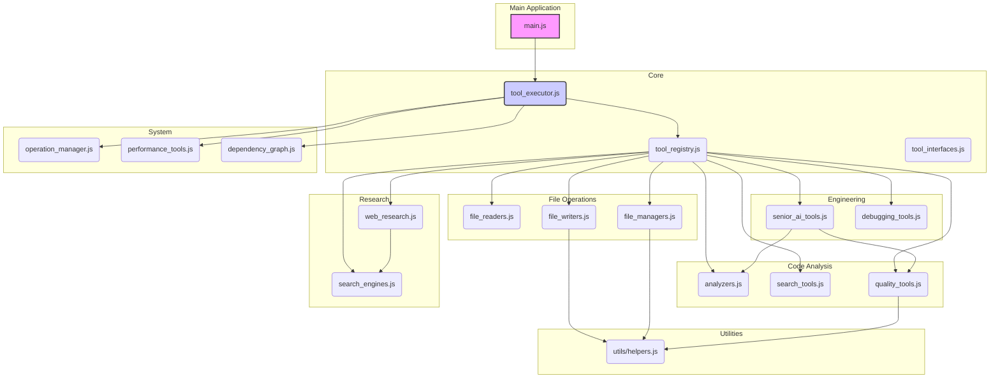

# ADR 005: Splitting `tool_executor.js` into Organized Modules

**Date**: 2025-08-01

**Status**: Proposed

## Context

The `frontend/js/tool_executor.js` file has grown to over 5,000 lines, making it a significant source of technical debt. It is difficult to maintain, debug, and extend. This ADR proposes a detailed plan to refactor this monolithic file into a set of organized, domain-specific modules. This initiative is Phase 2.1 of the Tool System Fix & Improvement Plan.

## Decision

We will split `tool_executor.js` into multiple modules, organized by functionality, under a new `frontend/js/tools/` directory. This will improve maintainability, reduce complexity, and establish clear ownership for different parts of the tool system.

### New Directory Structure

```
frontend/js/tools/
├── core/
│   ├── tool_registry.js          # Tool definitions & registry
│   ├── tool_executor.js          # Core execution logic
│   └── tool_interfaces.js        # Standard interfaces
├── file_operations/
│   ├── file_readers.js           # read_file, read_multiple_files, etc.
│   ├── file_writers.js           # create_file, edit_file, etc.
│   └── file_managers.js          # delete, rename, folder ops
├── code_analysis/
│   ├── analyzers.js              # analyze_code, validate_syntax
│   ├── search_tools.js           # search_code, search_in_file
│   └── quality_tools.js          # code quality analysis
├── research/
│   ├── web_research.js           # perform_research, read_url
│   └── search_engines.js         # duckduckgo_search
├── engineering/
│   ├── senior_ai_tools.js        # Senior Engineer AI tools
│   └── debugging_tools.js        # debug_systematically
├── system/
│   ├── dependency_graph.js       # DependencyGraphManager
│   ├── operation_manager.js      # Active operations, cancellation
│   └── performance_tools.js      # Performance monitoring
└── utils/
    └── helpers.js                # Shared utility functions
```

### Module Architecture and Dependencies

The following diagram illustrates the proposed module architecture and their primary dependencies.



### Module Responsibilities and Interfaces

#### `core/`
- **`tool_executor.js`**:
    - **Exports**: `execute(toolCall, rootDirectoryHandle, silent)`
    - **Responsibilities**: The main entry point for all tool calls. It will import from `tool_registry` to find the correct handler and orchestrate the execution, calling into `operation_manager` and `performance_tools` as needed.
- **`tool_registry.js`**:
    - **Exports**: `toolRegistry`, `getToolDefinitions()`
    - **Responsibilities**: Defines the `toolRegistry` object that maps tool names to their handlers. It will import all tool handler functions from the other modules. `getToolDefinitions` provides the schema for the AI.
- **`tool_interfaces.js`**:
    - **Exports**: `createSuccessResponse`, `createErrorResponse`, `validateRequiredParams`, `validateParameterTypes`
    - **Responsibilities**: Provides standardized functions for creating responses and validating parameters, to be used by all tool handlers.

#### `file_operations/`
- **`file_readers.js`**: Exports all file reading tool handlers (e.g., `_readFile`, `_readFileLines`).
- **`file_writers.js`**: Exports all file writing tool handlers (e.g., `_createFile`, `_applyDiff`).
- **`file_managers.js`**: Exports all file and folder management tool handlers (e.g., `_deleteFile`, `_renameFolder`).

#### `code_analysis/`
- **`analyzers.js`**: Exports code analysis handlers (e.g., `_analyzeCode`, `_analyzeSymbol`).
- **`search_tools.js`**: Exports code search and indexing handlers (e.g., `_searchCode`, `_buildCodebaseIndex`).
- **`quality_tools.js`**: Exports code quality handlers (e.g., `_formatCode`, `_analyzeCodeQuality`).

#### `research/`
- **`web_research.js`**: Exports `_performResearch` and `_readUrl`.
- **`search_engines.js`**: Exports `_duckduckgoSearch`.

#### `engineering/`
- **`senior_ai_tools.js`**: Exports all advanced "Senior Engineer AI" tool handlers.
- **`debugging_tools.js`**: Exports `_debugSystematically`.

#### `system/`
- **`dependency_graph.js`**: Exports the `DependencyGraphManager` class and related tool handlers.
- **`operation_manager.js`**: Exports the `CancellationToken` class and all functions for managing operation state, timeouts, and cancellation. It will also export the `debuggingState` object (which will be renamed to `operationState`).
- **`performance_tools.js`**: Exports all functions related to performance tracking, smart tool selection, error analysis, and caching.

#### `utils/`
- **`helpers.js`**: Exports stateless utility functions like `stripMarkdownCodeBlock`.

### Migration Strategy

The migration will be performed in a step-by-step manner to minimize disruption.

1.  **Create New Directory Structure**: Create the new directories under `frontend/js/tools/`.
2.  **Create New Files**: Create the empty JavaScript files within the new directories as outlined above.
3.  **Move Utility Functions**: Start by moving the most generic, stateless helper functions to `utils/helpers.js`. Update all their call sites in `tool_executor.js`.
4.  **Move System Components**: Move the `system/` components next, as they are foundational.
    -   Move `CancellationToken`, timeout functions, and `debuggingState` to `system/operation_manager.js`.
    -   Move performance and caching functions to `system/performance_tools.js`.
    -   Move `DependencyGraphManager` and its related classes to `system/dependency_graph.js`.
    -   Update `tool_executor.js` to import these from their new locations.
5.  **Move Tool Handlers by Category**: Move the actual tool handler functions (`_functionName`) into their respective new modules, one category at a time (e.g., start with `file_operations`).
    -   For each function moved, export it from its new module.
    -   In `core/tool_registry.js`, import the moved function and update the `toolRegistry` to point to the imported handler.
6.  **Refactor `tool_registry.js`**: Once all tool handlers are moved, `core/tool_registry.js` will consist mainly of imports and the large `toolRegistry` object.
7.  **Refactor `tool_executor.js`**: This file will be significantly smaller, containing only the core `execute` logic. It will import dependencies from the new `core`, `system`, and `utils` modules.
8.  **Final Cleanup**: After all code has been moved, delete the original `frontend/js/tool_executor.js` and update any remaining import paths in other parts of the application (e.g., `main.js`).

## Consequences

-   **Positive**:
    -   **Improved Maintainability**: Code will be easier to find, understand, and modify.
    -   **Clear Ownership**: It will be clear which module is responsible for which functionality.
    -   **Reduced Complexity**: Smaller, focused modules are easier to reason about than one large file.
    -   **Better Testability**: Individual modules can be tested in isolation more easily.
-   **Negative**:
    -   **Increased Number of Files**: The project will have more files, which can slightly increase complexity in terms of file management.
    -   **Merge Conflicts**: During the transition, there is a higher risk of merge conflicts if multiple developers are working on the tool system. This will be mitigated by performing the refactor as a single, focused effort.